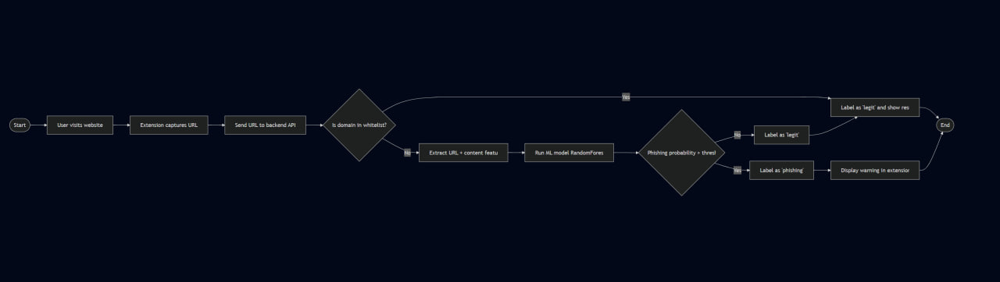
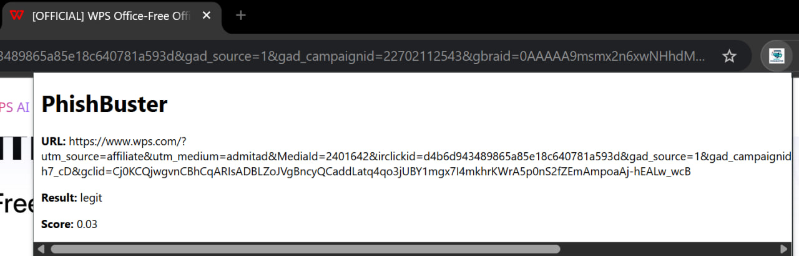
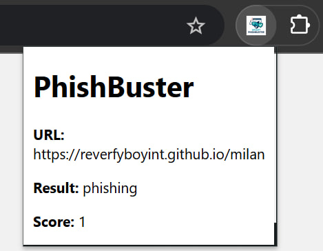
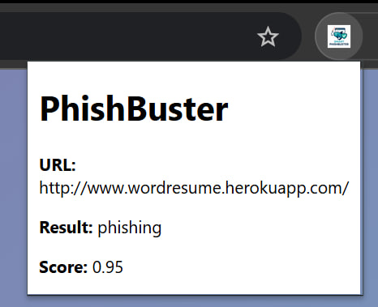
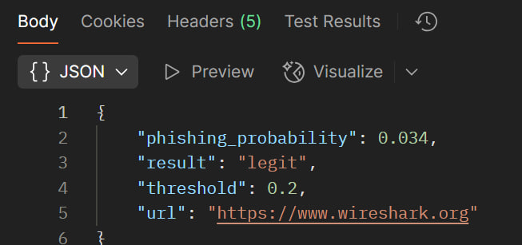
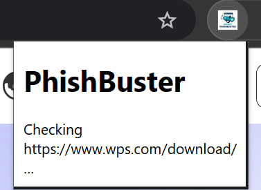

# Smart PhishBuster 

A real-time phishing detection system combining a browser extension and a Python machine learning backend. Detects phishing attempts by analyzing suspicious URLs, webpage content, and user behavior—using an ML model trained on thousands of real-world examples.
---
# What does it do?
Analyzes URLs and webpage features, predicts ‘legit’ or ‘phishing’,and displays a warning in the browser.

It looks at the URL and the page behind it and pulls out 30 simple yes/no signals:

“Does the address use an IP number instead of a name?”

“Is it really long?”

“Does it have weird JavaScript tricks?”

“Is it on a shortener like bit.ly?”

…and so on, up to “Is it known as malware by Google Safe Browsing?”

Each signal becomes a +1 (yes) or –1 (no).
---

##  Features

- 30+ feature extraction from URLs, domain info, and page content
- Random Forest classifier (95% accuracy, balanced precision/recall)
- Flask API for fast /predict endpoint
- Chrome Extension for real-time site checks
- Whitelisting of trusted domains and popularity-based overrides
- Parallel, cached feature extraction for fast response times
- Full test suite and easy retraining pipeline

---

##  **Workflow Overview**

Workflow: 
---

##   Screenshots


- Legitimate site verdict: 

- Phishing site warning: 

- Phishing site warning2: 

- API return: 

- Checking process: 

---

##  Installation

Clone the repo and set up a virtual environment:

```bash 
git clone https://github.com/Wheesk/smart_phishbuster.git
cd smart-phishbuster
python -m venv .venv

# Windows:
.venv\Scripts\activate

# macOS/Linux:
source .venv/bin/activate

pip install -r requirements.txt
```

##  Threshold Tuning
Model performance can be tuned by selecting a different decision threshold. Here are precision/recall values at various thresholds:
```bash
Threshold	Precision	Recall
0.00	    0.50	    1.00
0.01    	0.67     	1.00
0.02	    0.69    	0.99
0.04	    0.75	    0.99
0.07    	0.90	    0.98
0.11	    0.92    	0.98
0.14	    0.94    	0.98
0.32	    0.97    	0.97
0.68	    0.99    	0.94
0.87	    0.99    	0.93
0.90	    0.99    	0.89
0.93	    1.00    	0.86
0.98	    1.00    	0.81
1.00	    1.00    	0.76

Very low threshold (e.g. 0.00–0.06) Recall=100% →  catches every phishing URL.
Precision low (50–70%) → but half (or more) of “phishing” alerts are false alarms.

Mid-range threshold (e.g. 0.19)Recall ≈ 96% → catches almost every phish.
Precision ≈ 94% → and over nine out of ten of alerts are real phishing.

High threshold (e.g. 0.85–0.99)
Precision=100% → when you say “phishing,” you’re never wrong.
Recall drops to 83–57% → misses a lot of real phishing sites.

In summary:
By lowering the threshold, I catch more phishing sites but also create more false alarms; 
by raising it, I eliminate false alarms at the cost of missing more phishing sites; 
a middle-ground threshold (around 0.19) catches most phishing while keeping false alarms very low.
```
## 📈 Example Model Training Output
```
🔍 Shape   : (1992, 31)
🟢 Legit   : 995
🔴 Phish   : 997
❓ Missing : False
✔️  Trained — Classes: [-1  1]
📊 Accuracy : 0.9449
📋 Report   :
               precision    recall  f1-score   support

          -1       0.95      0.94      0.95       216
           1       0.94      0.95      0.94       183

    accuracy                           0.94       399

Those 30 numbers get “scaled” so our model treats them fairly.

A Random Forest classifier (think: a committee of decision-trees) looks at the pattern of +1/–1 and returns a probability that the site is phishing.
```

## 🏗️ Project Structure
```
Smart-Phish-Buster/
│
├── backend/
│   ├── app.py
│   ├── generate_features.py
│   ├── threshold_tuning.py
│   ├── url_features.py
│   ├── model_loader.py
│   
│─── model/
│       ├── phishing_model.pkl
│       ├── scaler.pkl
│       └── feature_names.txt
│       └── train_model.py
├── data/
│   ├── PhiUSIIL_Phishing_URL_Dataset.csv
│   ├── full_feature_dataset.csv
│   └── balanced_dataset.csv
│   └── balance_dataset.py
│
├── extension/
│   ├── manifest.json
│   ├── background.js
│   ├── popup.html
│   ├── popup.js
│   └── icon.png
│
│
├── requirements.txt
├── README.md
```

## 📝 Limitations & Future Work
Most phishing URLs are dead (normal in research)

Occasional false positives on very long legit URLs (can be handled with more training data and whitelisting)

Can integrate real-time feeds (PhishTank/OpenPhish) for even fresher data

Deployment on cloud (Render/Heroku) and Chrome Web Store possible

---

## 🚦 Quickstart
Install requirements
```bash
python -m venv .venv
```
#
 Windows:
```
.venv\Scripts\activate
```
 macOS/Linux:
```
source .venv/bin/activate
```
```
pip install -r requirements.txt
```
Generate features, train the model

```bash
cd backend
python generate_features.py
python train.py
```
Run backend

```bash
python app.py
```
Load extension in Chrome

Go to chrome://extensions

Enable "Developer Mode"

Click "Load unpacked" and select the extension folder

Start testing live URLs!

---

## 📚 References
PhishTank

Kaggle Web Page Phishing Detection

scikit-learn docs

Flask

---

## 🪪 License
MIT License

----

## 💡 Questions or Issues?
Open an issue, or contact me at wheesk122@gmail.com

